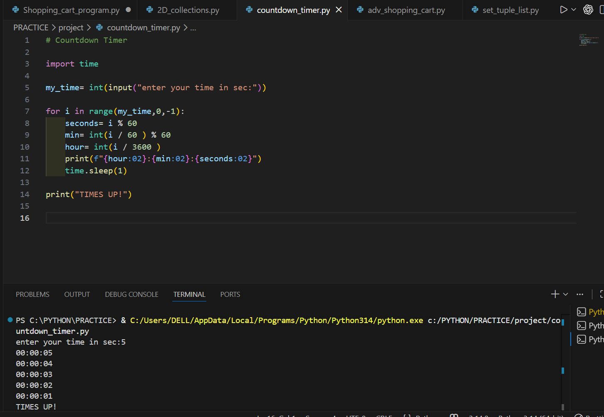

# ⏳ Countdown Timer in Python

A simple **Python countdown timer** that takes time input in seconds and displays a live countdown in `HH:MM:SS` format until the timer reaches zero.

## 🚀 Features
- Accepts user input in **seconds**
- Displays time in **HH:MM:SS format**
- Updates the countdown **every second**
- Shows **"TIMES UP!"** when the timer finishes
- Beginner-friendly Python project

## 🛠️ Built With
- Python
- `time` module

## ▶️ How to Run

1. Make sure **Python is installed** on your system.
2. Clone the repository or download the file.
3. Run the script:

```bash
python countdown_timer.py
```

4. Enter the time in **seconds** and the countdown will begin.
---

## 📸 Demo



## 📚 What I Learned
- Python loops (`for`)
- Time formatting
- Using the `time.sleep()` function
- Basic user input handling

## ⭐ Contribute
Feel free to fork this repository and improve the timer with new features like:
- GUI version
- Sound alert when time ends
- Pause/Resume functionality

---

💻 Beginner Python Project
